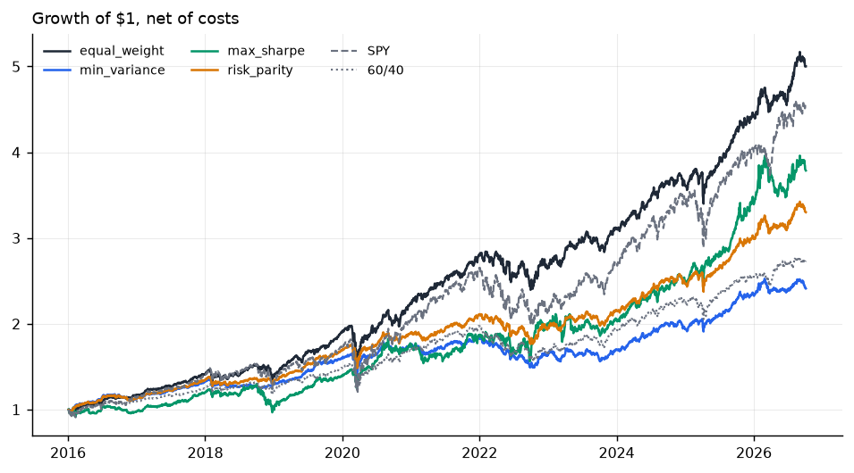
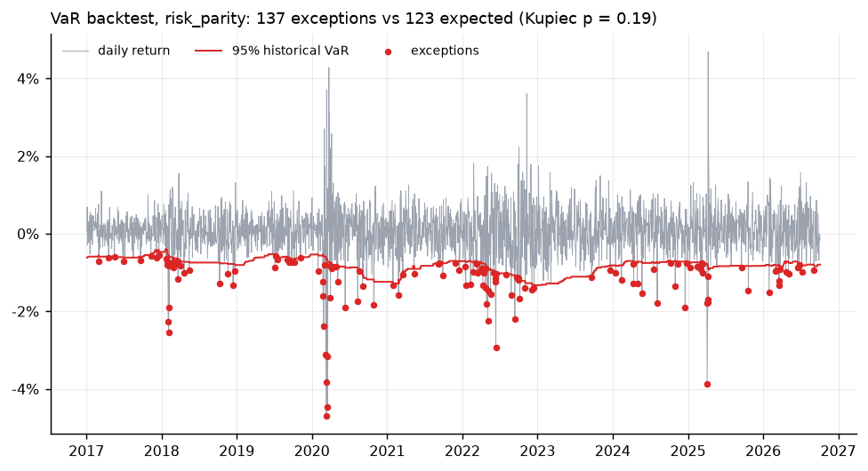
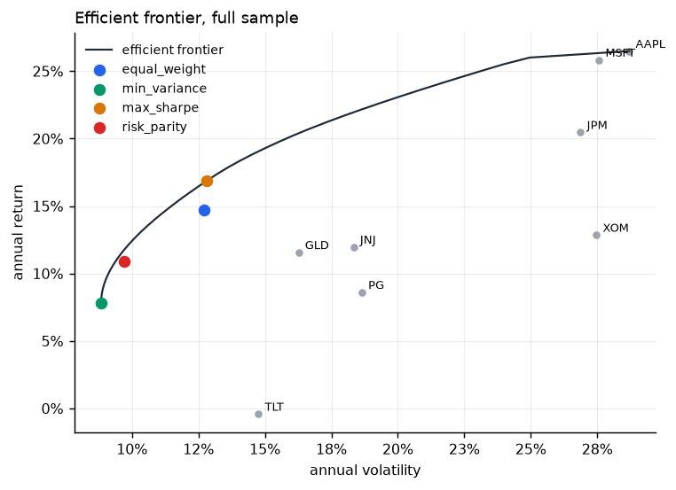
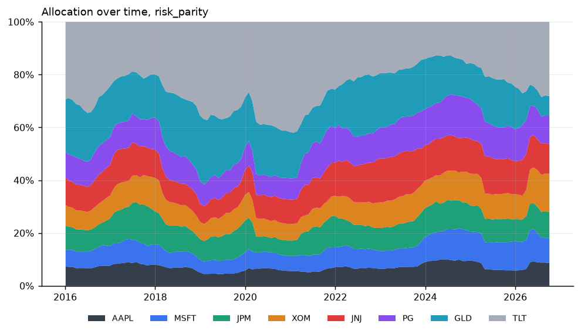
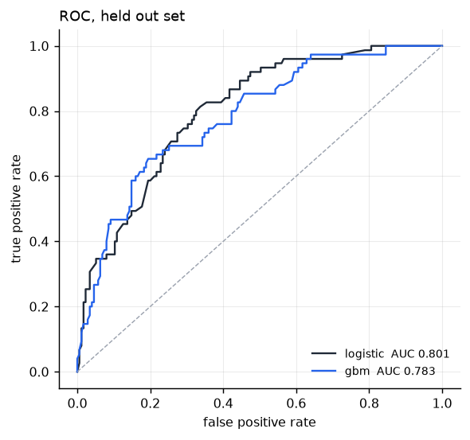
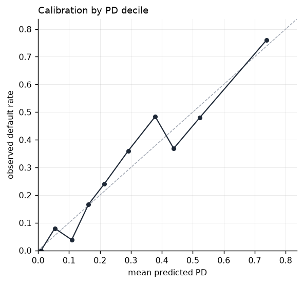
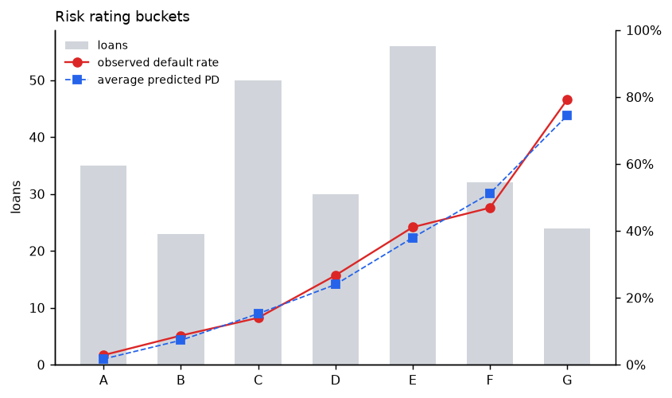
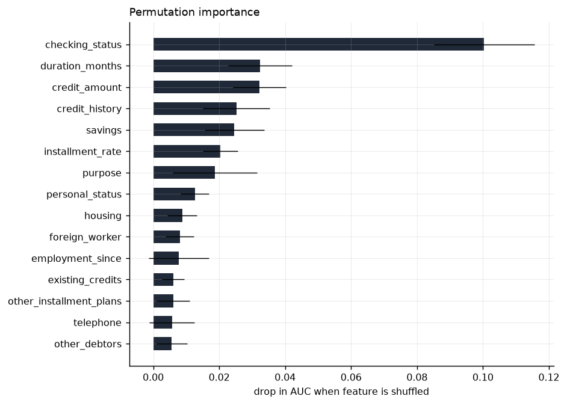

# risklab

Two quantitative risk tools in one small Python package.

**Portfolio risk analyzer.** Pulls daily prices, computes volatility and Value at Risk
(historical, parametric, Cornish Fisher, Monte Carlo), builds minimum variance, maximum
Sharpe and risk parity portfolios, and backtests them walk forward against SPY and a
60/40 benchmark. The VaR model itself is backtested with a Kupiec test.

**Credit risk model.** Trains calibrated logistic regression and gradient boosting
classifiers on loan data to predict probability of default, picks a decision threshold
from a cost ratio, maps PDs to rating buckets, and exports everything needed for a
Power BI or Tableau dashboard.

```
pip install -e .
risklab portfolio
risklab credit
```

Each command writes charts, CSVs and a `summary.md` to `reports/`. No API keys needed.

## Portfolio

```
risklab portfolio --tickers AAPL MSFT JPM XOM JNJ PG GLD TLT --start 2015-01-01
```

Weights are re-estimated at each month end from the trailing 252 days, held until the
next rebalance, and charged 5 bps per unit of turnover. Benchmarks are SPY and a monthly
rebalanced 60/40 of SPY and AGG.

|  | CAGR | Vol | Sharpe | Sortino | Max DD | VaR 95 | CVaR 95 | Beta | Turnover |
|---|---:|---:|---:|---:|---:|---:|---:|---:|---:|
| equal_weight | 16.2% | 12.5% | 1.26 | 1.60 | -23.9% | 1.1% | 1.8% | 0.62 | 4.7% |
| min_variance | 8.6% | 8.7% | 0.99 | 1.32 | -19.1% | 0.8% | 1.2% | 0.23 | 11.0% |
| max_sharpe | 13.2% | 15.7% | 0.87 | 1.13 | -25.6% | 1.5% | 2.4% | 0.47 | 38.0% |
| risk_parity | 11.8% | 9.3% | 1.24 | 1.63 | -16.6% | 0.8% | 1.3% | 0.38 | 5.6% |
| SPY | 15.2% | 17.7% | 0.89 | 1.08 | -33.7% | 1.7% | 2.7% | 1.00 | 0.0% |
| 60/40 | 9.8% | 11.0% | 0.91 | 1.10 | -21.6% | 1.0% | 1.7% | 0.61 | 0.0% |

*2016 to 2026, net of costs. VaR and CVaR are one day, 95%.*





<p>
 
</p>

Options:

```
--strategies equal_weight min_variance max_sharpe risk_parity
--lookback 252        estimation window in trading days
--freq M              rebalance W, M or Q
--cost-bps 5          one way trading cost
--max-weight 1.0      cap on any single position
--alpha 0.95          VaR confidence level
--rf 0.0              annual risk free rate for Sharpe and max Sharpe
--refresh             ignore the cached prices in data/prices.csv
```

## Credit

```
risklab credit
risklab credit --source lendingclub --path data/lending_club.csv --sample 200000
```

Ships with the UCI German Credit dataset (1,000 loans, 30% default rate) so it runs
offline. The Lending Club adapter reads the public 2007 to 2018 accepted loans export,
keeps finished loans, and parses the percentage and term strings.

| Model | AUC | Gini | KS | Brier | Precision | Recall | Approval rate | Default rate (approved) |
|---|---:|---:|---:|---:|---:|---:|---:|---:|
| logistic | 0.801 | 0.603 | 0.476 | 0.160 | 45.8% | 86.7% | 43.2% | 9.3% |
| gbm | 0.783 | 0.566 | 0.459 | 0.166 | 44.1% | 80.0% | 45.6% | 13.2% |

*German Credit, 250 held out loans. Threshold minimises cost with a missed default
weighted 5x a declined good loan, the cost matrix that ships with the dataset.*

<p>
 
</p>





Score new applications with the saved model:

```
risklab score new_loans.csv --out scored.csv
```

## Dashboards

`reports/credit/scored_loans.csv` and `reports/portfolio/returns.csv` are flat tables
designed to drop into Power BI or Tableau. [dashboards/](dashboards/) has page layouts,
a DAX measures file, a Power BI theme, and Tableau calculated fields.

## Method notes

- VaR is reported as a positive loss fraction. Historical VaR is the empirical quantile,
  parametric assumes normal returns, Cornish Fisher adjusts the normal quantile for
  skew and excess kurtosis, Monte Carlo draws correlated normal asset returns and
  applies the portfolio weights.
- The Kupiec proportion of failures test compares the number of days the loss exceeded
  the prior day's rolling VaR with the number implied by the confidence level. A
  p-value under 0.05 means the model is producing too many or too few exceptions.
- Risk parity solves the convex problem `min 0.5 w'Cw - sum(log w) / n` and rescales,
  which gives exact equal risk contributions without a nonconvex least squares fit.
- Credit models are wrapped in isotonic calibration (5 fold) so the PDs can be read as
  probabilities. Feature importance is permutation based on the held out set, so it is
  comparable across model types.
- Rating buckets A to G are fixed PD bands (0 to 5%, 5 to 10%, 10 to 20%, 20 to 30%,
  30 to 45%, 45 to 60%, 60%+).

## Layout

```
risklab/
  portfolio/   data, metrics, optimize, backtest, report, pipeline
  credit/      data, model, report, pipeline
  cli.py
data/          german_credit.csv (vendored), prices.csv (cached on first run)
dashboards/    Power BI and Tableau assets
scripts/       build_german_credit.py rebuilds the vendored CSV from UCI
tests/
```

```
make setup
make test
```

MIT.
